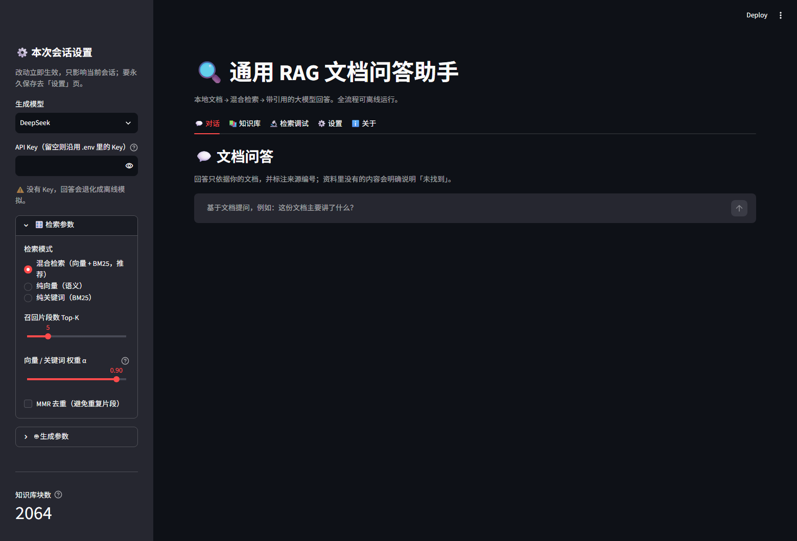
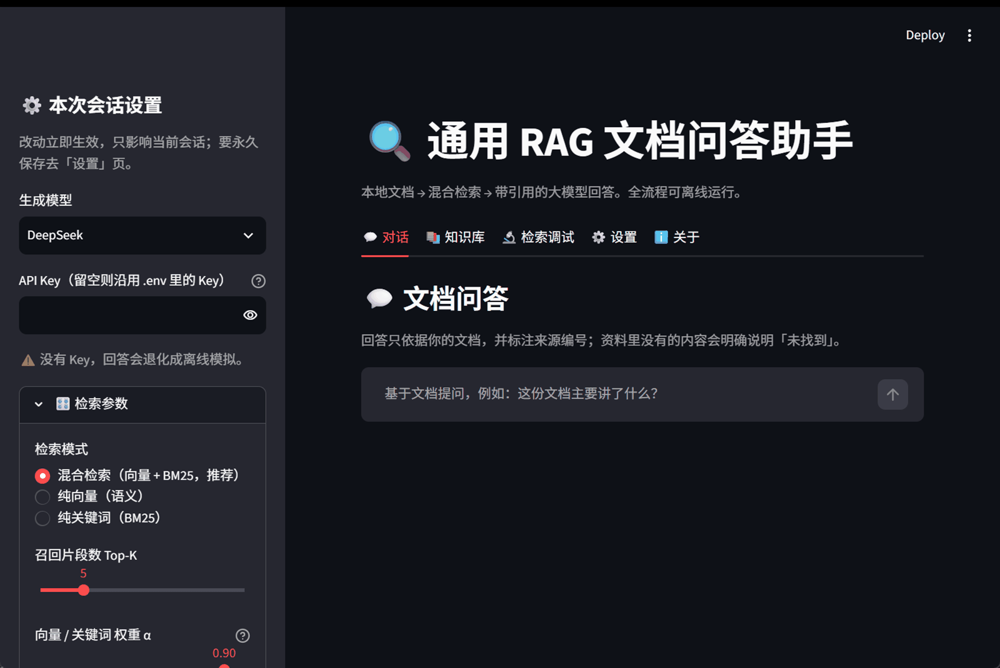

# General-Purpose RAG Document QA

English | [简体中文](README.md)

> Drop in your documents (docx / pdf / txt / md / html / csv / xlsx / json), ask questions
> in plain language, and get answers **with citations**. Runs fully offline — no API key
> required (it falls back to an offline mock mode).

This is a readable, hackable, measurable RAG implementation:
every stage (loading / chunking / retrieval / generation / evaluation / serving) is a
separate module with test coverage.



Works without any API key: retrieval still runs, answers fall back to offline assembly,
and nothing external is called.



---

## Features

| Capability | Notes |
| --- | --- |
| **8 file formats + batch ingest** | Directories are scanned recursively; many files in one go |
| **Structure-aware chunking** | Recognises headings such as `第X回 / Chapter 3 / 1.2.3 / # Markdown / References`, keeping the section path inside each chunk |
| **Hybrid retrieval** | Dense vectors + BM25 keywords, fused with RRF (not naive weighted summation) |
| **Optional refinement** | MMR de-duplication, similarity threshold, CrossEncoder re-ranking — all switchable |
| **Citations** | Answers carry `[1][2]` markers that map back to section and page |
| **Incremental ingest** | Chunk IDs are content hashes, so re-ingesting is idempotent; changing one file re-indexes only that file |
| **Offline evaluation** | Ships with a dataset and metrics (Hit@k / MRR / keyword coverage) |
| **Observability** | Per-stage trace (latency + candidate counts), unified logging, environment self-check |
| **Three entry points** | Streamlit UI / CLI / REST API sharing one core |
| **Tests + CI** | 74 tests, no network and no real model required; GitHub Actions on every push |

---

## Quick start

```bash
git clone https://github.com/lvliyudashuai/hybrid-rag.git
cd hybrid-rag

python -m venv .venv
source .venv/bin/activate        # Windows: .venv\Scripts\activate
pip install -r requirements.txt

cp .env.example .env             # edit as needed; works without any key
python rag.py --doctor           # environment self-check
python rag.py --rebuild          # build the index (downloads the embedding model once)
python rag.py "What is this document about?"
streamlit run app.py             # launch the UI
```

Install CUDA builds of PyTorch following [pytorch.org](https://pytorch.org) before the rest
if you want GPU acceleration. Without any API key the system runs in **offline mock mode**:
retrieval still works, the answer is composed from the most relevant passages, and no
external service is called.

### Windows: just double-click

After installing the dependencies, double-click `start.bat`. It checks whether the service is
already running, starts one if not, waits for the health check, then opens an app window — so
you never stare at a blank page. **Closing that console window stops the service.**

Want a desktop icon (the icon is borrowed from Python; adjust paths as needed):

```powershell
$shell = New-Object -ComObject WScript.Shell
$desktop = [Environment]::GetFolderPath("Desktop")
$lnk = $shell.CreateShortcut("$desktop\RAG QA Assistant.lnk")
$lnk.TargetPath = "$PWD\start.bat"
$lnk.WorkingDirectory = "$PWD"
$lnk.Save()
```

The bundled `.streamlit/config.toml` turns on `server.runOnSave`: save a `.py` file and the page
reloads on its own — no manual Rerun.

---

## Project layout

```
config.py         single source of truth for configuration (typed, validated)
docmodel.py       Block / Section data models
loaders.py        loaders for 8 formats + directory/glob expansion
headings.py       heading-recognition engine shared by docx / pdf / text
chunking.py       chunking + section prefix + stable chunk IDs
vectorstore.py    embedding model and Chroma access, stats, orphan cleanup
bm25.py           BM25 keyword retrieval (jieba tokenizer, query-side stopwords)
retrieval.py      hybrid retrieval: dual recall -> RRF fusion -> MMR -> rerank
llm.py            LLM providers (DeepSeek/OpenAI/Claude/Ollama, streaming, retries)
query.py          prompt construction, citations, answer generation
ingest.py         ingest orchestration (batch, incremental, per-file failure isolation)
evaluate.py       offline evaluation (Hit@k / MRR / keyword coverage)
app.py            Streamlit UI     rag.py CLI     api.py REST API
launch.py         one-click launcher + start.bat (double-click entry)
.streamlit/       local Streamlit config (auto-reload on save, usage stats off)
tests/            74 tests (fake embeddings, no network)
eval/             evaluation dataset and reports
```

## Retrieval: why hybrid, and how

Vectors alone miss exact terms (IDs, clause numbers, model names); BM25 alone fails on
paraphrases. So both channels recall, and we fuse with **RRF (rank-based)** rather than
weighted scores — vector similarity lives in `0..1` while BM25 scores can reach `0..20+`,
so a plain sum would be dominated by BM25:

```
score = alpha * 1/(k + vector_rank) + (1-alpha) * 1/(k + keyword_rank)   # k defaults to 60
```

## Evaluation

```bash
python evaluate.py                    # compare the three modes
python evaluate.py --show-failures    # inspect misses
```

Measured on the bundled sample document (90 chapters / 2064 chunks, 14 questions, k=5,
Qwen3-Embedding-0.6B, RTX 5070):

| Mode | Hit@5 | MRR | Keyword coverage | Avg latency |
| --- | --- | --- | --- | --- |
| Vector only | 78.6% | 0.386 | 64.3% | 59 ms |
| BM25 only | 42.9% | 0.157 | 50.0% | 63 ms |
| **Hybrid (alpha=0.9)** | **78.6%** | **0.410** | **64.3%** | 159 ms |

The sample corpus is classical Chinese, where BM25 is at a disadvantage — hence the high
optimal alpha. Tune `HYBRID_ALPHA` on **your own** data with `evaluate.py`.

## Usage

```bash
python rag.py --doctor                    # environment self-check
python rag.py --rebuild                   # rebuild the index
python rag.py --ingest ./docs --append    # incremental ingest
python rag.py "question" --trace          # single question with per-stage timings
python rag.py                             # interactive multi-turn
python rag.py --stats / --prune           # index stats / cleanup
python launch.py                          # start the server and open an app window
python api.py                             # REST API (docs at /docs)
```

## Configuration

Everything lives in `.env` (see `.env.example`) and can also be edited from the Settings
tab in the UI. Highlights: `EMBEDDING_MODEL`, `RETRIEVAL_MODE`, `HYBRID_ALPHA`,
`CHUNK_SIZE`, `USE_RERANK`, `MAX_CONTEXT_CHARS`.

See [docs/ARCHITECTURE.md](docs/ARCHITECTURE.md) for design rationale and extension points.

## Tests

```bash
pip install -r requirements-dev.txt
pytest tests -q      # ~25s, no network, no GPU
ruff check .
```

## License

[MIT](LICENSE)
